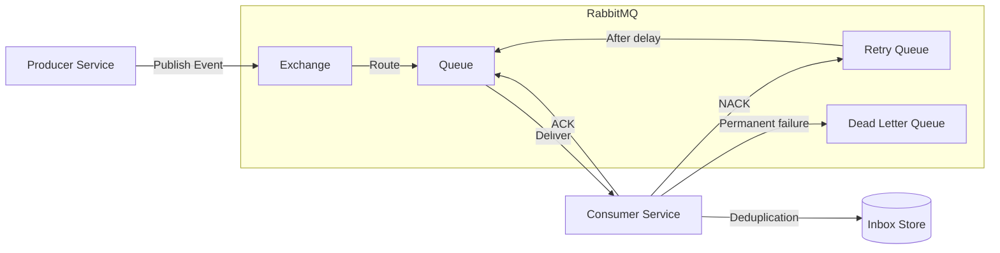

# Architecture Overview

## 1. Purpose

This document provides a **high-level overview of the system architecture** implemented in this repository.

It is intended to be the **first document to read**, before diving into detailed messaging concepts,
code structure, or architectural decision records (ADRs).

The goal is to answer, at a glance:
- What kind of system this is
- How its main components interact
- Where RabbitMQ fits
- How reliability concerns are addressed
- What is conceptual vs implementation-specific

---

## 2. System Overview

This repository demonstrates a **service-oriented, event-driven architecture (EDA)** built around
asynchronous messaging using **RabbitMQ**.

The system is composed of **independent services** that communicate by publishing and consuming events.
Services do not call each other directly; instead, they exchange messages through the broker.

At a high level:
- Services emit events when something relevant happens
- Other services react to those events
- Messaging is asynchronous and decoupled
- Reliability is achieved through explicit architectural patterns

---

## 3. High-Level Architecture Diagram

The diagram below illustrates the **main components** of the system and how they interact at a high level.

This diagram intentionally abstracts implementation details and focuses on **responsibilities and data flow**.

---

## 4. Core Components

### 4.1 Services
- Own their business logic and data
- Publish integration events when relevant facts occur
- Consume events from other services
- Are independently deployable

Services do **not** share databases or domain models.

---

### 4.2 RabbitMQ (Message Broker)

RabbitMQ acts as the **central messaging backbone**.

Responsibilities:
- Message routing via exchanges and queues
- Supporting retries and dead-lettering
- Preserving delivery guarantees
- Decoupling producers and consumers

RabbitMQ is treated strictly as **infrastructure**, not part of the domain.

---

### 4.3 Events

Events represent **facts that already happened**.

Two conceptual categories exist:
- **Domain Events**: internal to a service
- **Integration Events**: published for other services to consume

Only integration events cross service boundaries.

---

## 5. Messaging Flow (Conceptual)

At a conceptual level:

1. A producer service executes a business operation
2. A domain event is raised internally
3. The application layer maps it to an integration event
4. The event is published to RabbitMQ
5. One or more consumers receive the event
6. Consumers execute their own business logic

There is **no direct coupling** between producers and consumers.

---

## 6. Reliability Model

The architecture explicitly assumes that **failures will occur**.

To handle failures safely and predictably, the system adopts:
- **At-Least-Once delivery**
- **Idempotent Consumers (Inbox Pattern)**
- **Explicit retry policies**
- **Dead Letter Queues (DLQ)**
- **Manual message acknowledgements (ACK / NACK)**

These patterns ensure:
- No silent message loss
- Safe handling of duplicate deliveries
- Recoverable and observable failures

---

## 7. Conceptual vs Implementation Concerns

### Conceptual (Architecture-Level)
Defined by design:
- Event-driven communication
- Service boundaries
- Delivery guarantees
- Failure handling strategy
- Idempotency requirements

Documented in:
- Architecture docs
- ADRs

---

### Implementation (Code-Level)
Handled by specific layers:
- RabbitMQ configuration
- Serialization
- Retry queues and DLQ wiring
- Inbox persistence
- Logging and metrics

Implemented in:
- Infrastructure layer
- Host / composition root

---

## 8. Architecture and Code Alignment

This repository intentionally separates:
- **What the system is** (architecture)
- **How it is implemented** (code)

The architecture defines boundaries, responsibilities, and guarantees.
The code structure enforces these decisions.

For details, see:
- [Code Structure & Architecture Mapping](code-structure.md)

---

## 9. Clean Architecture Alignment

The system follows **Clean Architecture principles**:
- Domain logic is isolated and framework-independent
- Application layer orchestrates workflows
- Infrastructure handles messaging and external systems
- Host layer wires everything together

This ensures testability, replaceability, and long-term maintainability.

See:
- [Clean Architecture & DDD-Friendly Boundaries](clean-architecture-ddd.md)

---

## 10. How to Read This Repository

Recommended reading order:
1. **Architecture Overview** (this document)
2. Code Structure & Architecture Mapping
3. Core Messaging Concepts
4. Architectural Decision Records (ADR)
5. Code examples (when added)

---

## 11. What This Repository Is (and Is Not)

### This repository **is**:
- An architecture reference
- A learning resource for EDA
- A guide to production-grade messaging patterns

### This repository **is not**:
- A generic RabbitMQ SDK
- A framework
- A business-heavy application

It prioritizes **clarity of design** over feature completeness.

---

## 12. Related Documentation

- [Code Structure & Architecture Mapping](code-structure.md)
- [Clean Architecture & DDD-Friendly Boundaries](clean-architecture-ddd.md)
- [Architectural Decision Records (ADR)](../decisions)
